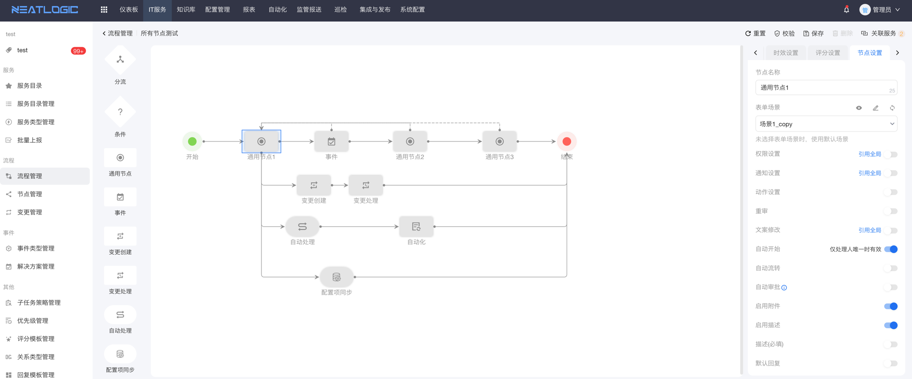
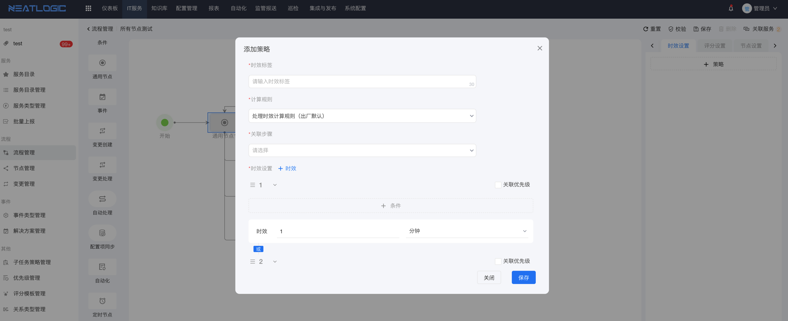
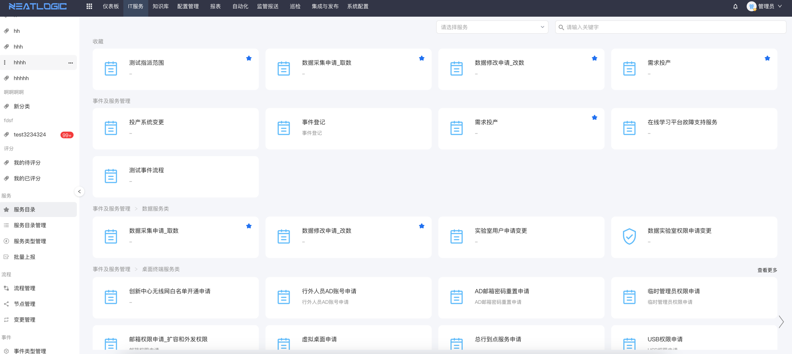
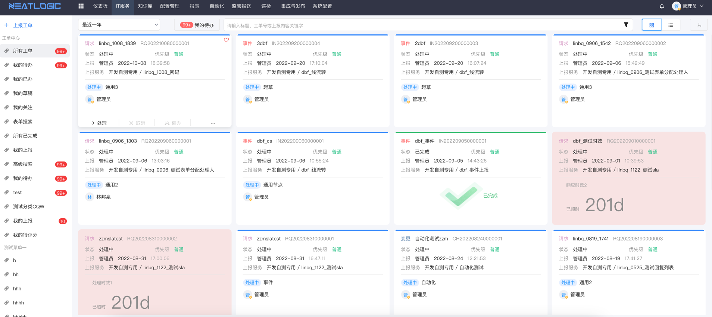

中文 / [English](README.en.md)

    

---

## 关于

neatlogic-itsm是it服务管理模块，自带工作流引擎、自定义表单、服务目录、SLA管理等功能。

## 主要功能

### 工作流

自带通用、条件、定时等内置节点，如果激活了其他功能模块，还能使用自动化、配置项同步、变更等专用节点。
支持串行、并行、条件、汇聚、分流、回退等流转方式。
支持通过扩展的方式实现自定义节点。

- 支持调用第三方接口，流程提供自动处理节点，用于在流程中调用第三方接口。
- 支持webhook触发器，工单或某个节点在指定状态下，触发调用第三方接口动作。
- 支持节点自动开始、自动流转。
- 支持复杂的工单分派逻辑，包括指定分派到人员、组织、角色、干系人、前置步骤处理人指定、或根据表单值指定。

### SLA

基于策略的SLA计算方式。

- 支持精确到工单的时效策略。
- 支持精确到节点的时效策略。
- 支持根据优先级、影响范围、上报人是否VIP等设置动态时效。
- 支持任务超时或临期通知。
- 支持任务超时或临期自动转派。

## 服务目录

- 支持自定义服务目录及层级关系。
- 支持自定义服务优先级、服务类别、服务上报权限等。

## 工单中心

工单中心允许用户根据个人角色预设各种搜索条件，方便跟踪各类工单。

